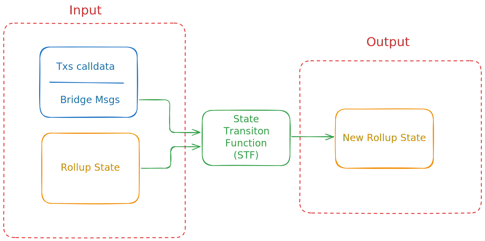
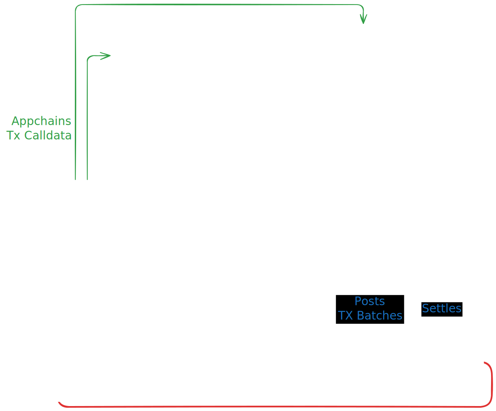
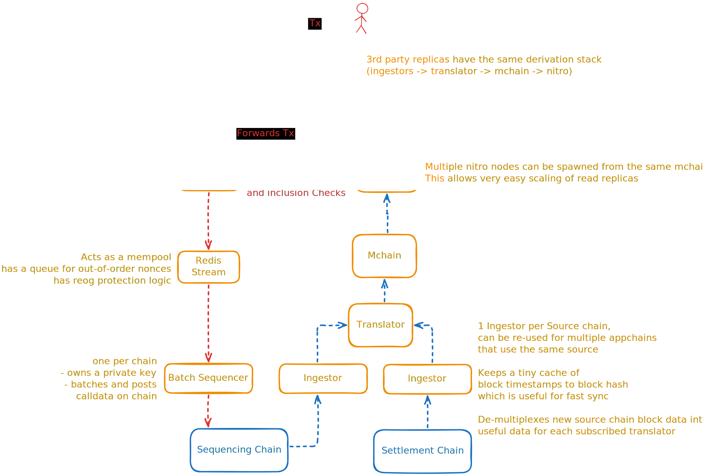
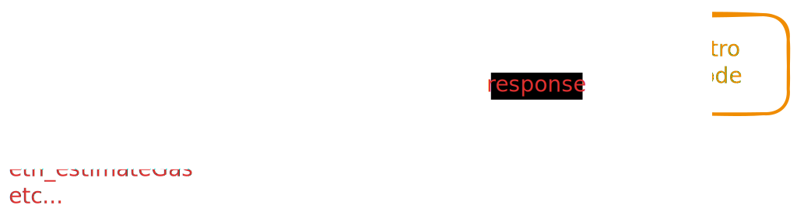
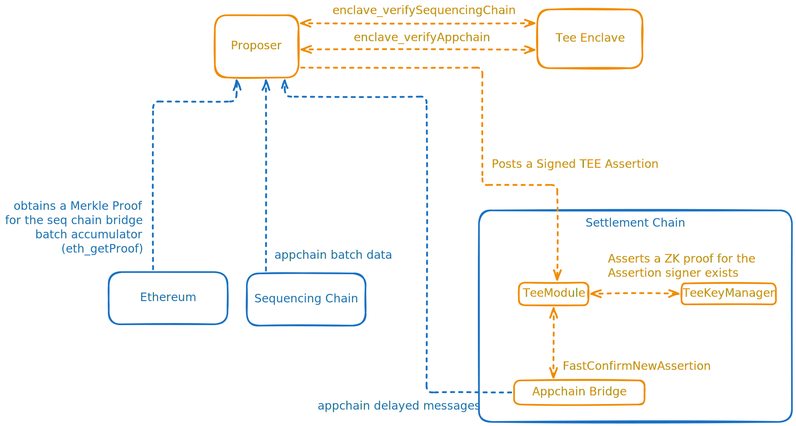
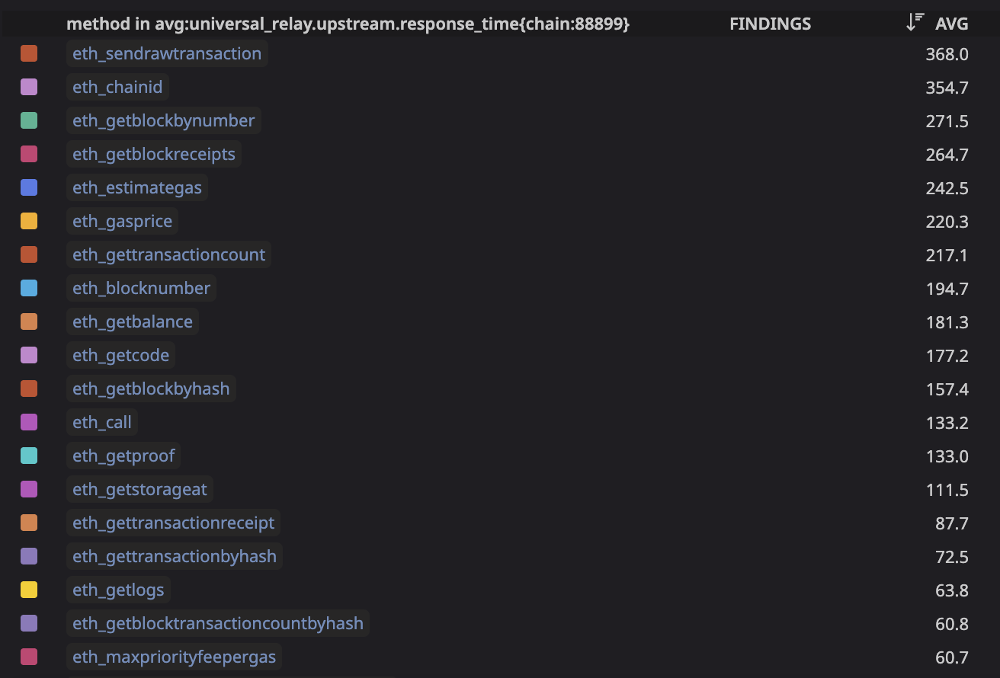
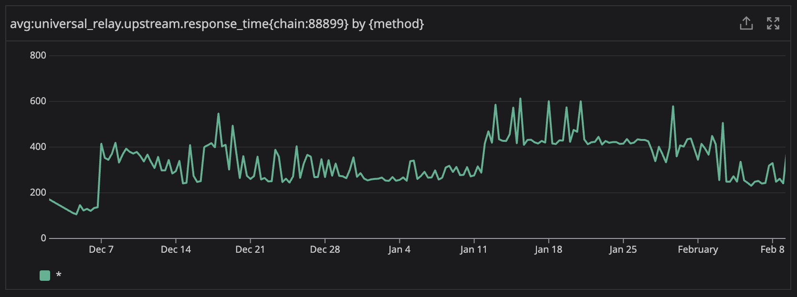
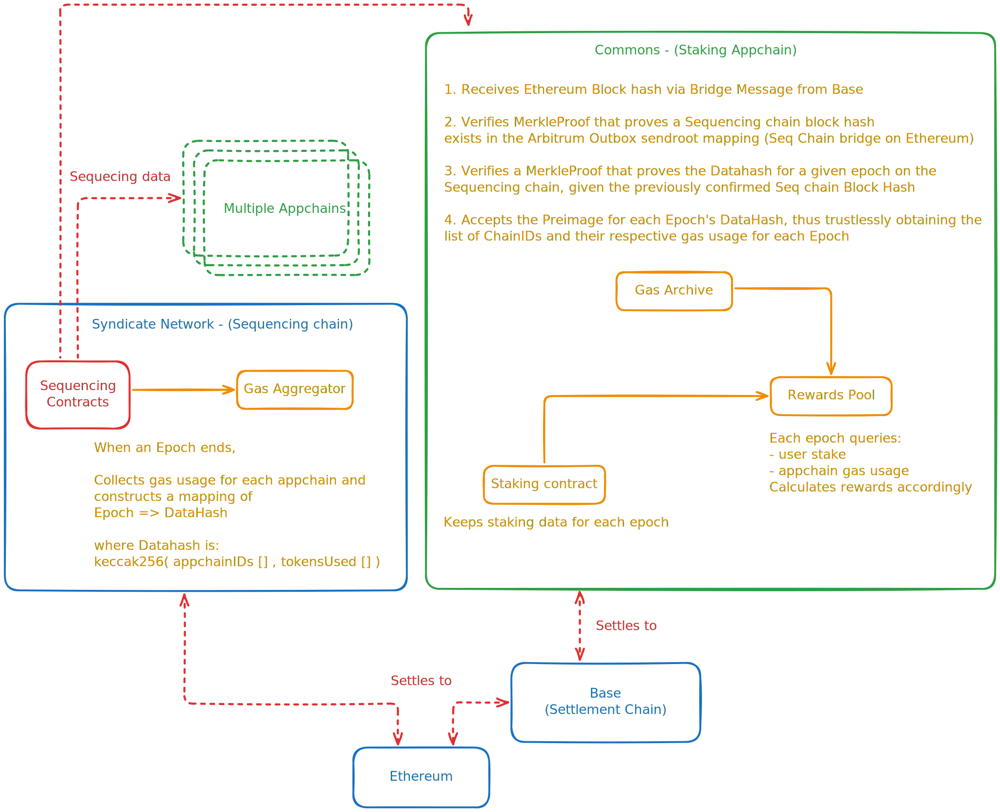

# [Syndicate Appchains]: Technical Retrospective

## Context & Motivation

### What is a Rollup

Ethereum Rollups are systems built on top of a given blockchain (the Parent chain), usually Ethereum, and seek to inherit the security guarantees of the Parent chain while providing cheaper, faster and dedicated blockspace. Rollups can also build novel functionality on-top of the parent chain, like custom precompiles or even completely different execution engines (VMs).

Appchains are essentially rollups that are purpose-built to a given Application (protocol) which benefit from the rollup cost/speed benefits.

Ethereum Rollups can be described as a function with the following inputs, outputs and transformations:

- Inputs
  - User transactions to the rollup (calldata)
  - Bridge Messages (txs sent from the parent chain - typically used for censorship resistance and to allow contracts from the parent chain to interact with the Rollup)
  - Current rollup state
- Outputs
  - The new rollup state
- State Transition Function (STF) - the sequence of operations that are executed on the input data that result on the new updated rollup state - typically called Derivation (where the new state is derived from the inputs), and its rules essentially consist of the execution engine code that is run by the rollup nodes.



### How are Syndicate Rollups (Appchains) different?

Syndicate appchains allow Rollup builders to customize their sequencing logic.
Usually, in vanilla rollups, the transactions sent to the Rollup are gathered by a Sequencer, which is a service controlled by the rollup operator that is in charge of making this data public.

In "normal" rollups the calldata for rollup transactions is posted to the Parent chain. In one of two ways:

- the calldata raw bytes are written to the blockchain
- a cryptographic commitment to the contents of the transaction (or batch of transactions) is posted on the parent chain while the actual raw bytes are stored and made available elsewhere (this is usually referred as an alt-da source).

Syndicate rollups replace the single-sequencer model with a more flexible design. A smart contract on the Syndicate chain (itself a rollup) defines business logic that determines who can submit ("sequence") transactions to a given Appchain. This sequencing contract becomes the canonical source for the Appchain's transaction calldata.



In a standard rollup, derivation reads all inputs — transaction calldata and bridge messages — from a single parent chain. Syndicate's sequencing model breaks this assumption: transaction calldata lives on the Sequencing chain, while bridge messages remain on the Settlement chain. Supporting this **split derivation** required a custom on/offchain architecture aware of both sources:

- Settlement chain - The canonical Parent chain where the Bridge contracts will live and messages will be exchanged with the Rollup
- Sequencing chain - The Syndicate Network chain where the Txs calldata will be available.

## Goals & Success Metrics

### Primary Goal

Bring Syndicate Appchains to life. Allow custom sequencing logic to become a reality for rollups.

### Non-functional Goals

- Low maintenance burden (minimal custom ops tooling, self-healing where possible)
- Developer ergonomics (onboarding time, deploy frequency)
- Writes must be durable and strongly consistent — no submitted transaction should ever be silently dropped. Reads should be highly available, serving the latest derived state even if derivation is temporarily behind the chain tip (i.e., reads may be stale but never unavailable).

## System Architecture

The Syndicate Rollup stack can be effectively sliced into 3 different classes of components:

### 1. The Read loop

- synd-chain-ingestor - Caches block data, streams updates via WebSocket
- synd-translator - Implements the slotting logic, combines source chain data into mchain blocks
- synd-mchain - Holds a RocksDB storage with batch/sequencing data and implements a minimal JSON-RPC interface for nitro

### 2. The Write loop

- synd-maestro - Transaction submission gateway - consumes transactions sent via JSON-RPC, makes some lean validation and stores them in a redis stream. Also has reorg-protection logic to ensure all transactions make it to the Appchains.
- synd-batch-sequencer - Batches/compresses txs, submits to sequencing chain

### 3. Withdrawals

- synd-enclave - Runs the STF on TeeInputs, signs state commitments.
- synd-proposer - Aggregates chain data, interfaces with the TEE enclave to obtain signed commitments, publishes assertions on the settlement chain.
- synd-tee-attestation-zk-proofs - CLI utility to generate ZK proofs for TEE x509 certificates (supports AWS nitro) and post them on-chain

Smart Contracts:
- TeeModule: Core state machine that queues TEE-signed assertions (containing appchain block hash + sendRoot), enforces a challenge window for fraud detection, and detects TEE compromise when conflicting assertions are submitted (paying a bounty to the reporter).
- TeeKeyManager: Permissionless registry of valid TEE signing keys. Anyone can register a key by submitting a valid attestation proof.
- AttestationDocVerifier: Verifies ZK proof for AWS Nitro attestations, asserts the certificate has the correct [PCRs](https://docs.aws.amazon.com/enclaves/latest/user/set-up-attestation.html#where) (used by the TeeKeyManager)

### Putting it all together 


This is how user transactions travel through the system (calls to `eth_sendRawTransaction`):




This is how user RPC queries are served (everything that is not `eth_sendRawTransaction`):




This is how the Withdrawals system works:



## Key Technical Decisions

### Technology choices
- Rust 🦀 - We chose Rust due to its security and performance characteristics and access to [Alloy](https://github.com/alloy-rs), which is currently the gold standard library to interact with EVM chains. 
- Arbitrum - We chose to leverage Arbitrum Nitro as the first rollup stack to build on top of due to its focus on low block times. Proximity with the Arbitrum team was also a big plus.

### Implementation Decisions
- Use timestamp to weave settlement and sequencing chains data together in a deterministic way - this is possible because timestamps are encoded in ethereum blocks, thus deterministic based on block data.
- No cryptographic commitment on the settlement chain for batches - this is okay because all rollups will eventually settle to Ethereum, which means participants can trustlessly verify the data. A commitment to the sequencing chain state is effectively equivalent to a commitment to the sequencing data for an Appchain (the sequencing data is a subset of the sequencing chain state).
- TEE for withdrawals: TEE allow for fast, trusted state derivation. Meaning secure and very fast withdrawal from Syndicate Appchains, given the state of the art.
- ZK proofs for TEE certificate verification: proofs are cheap to verify on chain and makes the implementation of a multi-TEE system much simpler.
- Redis Streams: decouples tx processing from batching and allows for a lightweight, durable mempool. Allows for trivial reorg-resistance and recovery from batch-sequencer failover.
- Helm + ArgoCD (GitOps): All appchain infrastructure is defined as Helm charts in a monorepo, deployed via ArgoCD's App of Apps pattern. This allows a new appchain to be spun up by adding a single entry to a values file and merging a PR — ArgoCD handles the rest. Combined with security hardening (non-root containers, read-only filesystems, mTLS) and Datadog-based observability baked into every chart, this keeps the operational overhead low even as the number of appchains grows.

## Challenges & Failures

- Due to the nature of the design, a sequencing chain block is necessary to seal an Appchain block. This is not a big deal if there is a lot of activity on the syndicate network. However, in the beginning this wasn't the case. A transaction sent to an appchain could take a while to be processed because Arbitrum blocks are produced on demand, and there wasn't enough activity to produce a sequencing block. To address this bootstrap problem, we deployed a simple application to post zero-value transactions to the sequencing chain periodically.
- withdrawals are very tricky to deploy with all correct settings, especially for migrated appchains, we built a CLI to make this process easier.
- withdrawals debugging is hard because of no TEE logs - Testnet setup and e2e tests to simulate the system were crucial to nail the correctness and availability for the TEE enclave.
- Smart Contract bugs - there was a tricky issue with the staking rewards contracts where users could claim more tokens than they should be able to. We successfully paused the problematic contract and migrated the funds to a safe newly deployed fixed version
- source RPC flakiness - Most of the performance hiccups originated from the source chain RPC ingestion. To address this, we implemented a multi-rpc configuration that could fallback to a backup provider if an issue was detected.

## Lessons & What I'd Do Differently

- merge mchain + translator - this is probably the main thing I would change in the current architecture. These components were designed with a clear logic separation. Translator handles the slotting + "block building" logic, while mchain stores all the blockchain data and exposes a JSON-RPC for nitro to read from. In practice, we could have developed these modules as distinct logical units but made them 1 single piece of the network topology. This would have simplified the infrastructure setup, eliminate a bunch of code/network calls between these two services, and overall reduce the cognitive load of thinking about the system which is a burden for maintainers.
- Config Manager - There was an attempt to create a "1 line config" for appchains, where there was a main registry per settlement chain and all node operators would have to do would be to have RPC connections to each source chain, know the appchain chainID and everything works. In practice this worked, but it got messy and hard to update because settlement chains could be different per appchains and we designed the configs to be non-upgradable and immutable. There were plans for an overhauled V2 where the registry would be centralized on Ethereum and config values were more flexible. Next time I'd design on-chain configuration to be malleable and with a single registry location.
- When thinking back on the Staking contracts, synd sequencing factory, etc. These contracts were developed and deployed as immutable - set in stone to adhere to the Ethereum mantra of "code is law" and give an extra layer of trust "we can't change the rules". Looking back I consider this was a mistake and it would have made our lives easier to go with industry-standard upgrade patterns. While the simplicity of immutable contracts is good in theory, in the real world it is very normal that we don't know the full picture when deploying the first version, there's lessons we learn along the way and improvements that only show themselves later.
- Universal relay per chain would allow more fine grained control over Observability. While developing the Universal Relay the way we did, with Cloudflare workers, was pretty successful and low maintenance, when investigation was necessary, it was slightly worse to have the invocations for ALL appchains on a single deployment. There's also the noisy-neighbor problem where traffic spikes on one appchain would affect all the others and users that would get rate-limited for an appchain, would get rate-limited for all of them. I think the current setup served us pretty well for now but would likely not scale effectively with the amount of appchains.
- We had alerts way too noisy initially. While at face value it seems good to be informed, this trains engineers that get pinged at each network fluctuation to ignore notifications "when everything is important, nothing is". We ended up toning down alerts and I'm pretty happy with the balance we managed to strike. Next time, I'd start with lots of slack warnings that could be toned down or escalated, instead of creating excess "emergency incidents".


## Results & Impact

Over the course of 4 Months (`v1.0.0` of Syndicate Appchains release on [Sep 2025](https://github.com/SyndicateProtocol/syndicate-appchains/releases/tag/v1.0.0)). There have been a number of appchains spawned:

- 16 Testnets
- 6 Mainnets

Anecdotal reports of user experience have been stellar. RPC requests by clients are perceived as being fast.
The network performance fluctuates over time with usage and is particularly prone to source chain performance hiccups, but here's an example of a load test executed in the testnets:

```
100 wallets - 3txns/wallet (Total: 300 txs - 30 batches) @ 20RPS:Latency Percentiles (Time to Receipt):
  Mean: 1.08870785s
  P50 : 1.085826901s
  P90 : 1.097293323s
  P99 : 1.177430333s
  Max : 1.190716833s
```

Latency measured at the Universal relay for the UNITE chain between Dec 2nd 2024 and Feb 9th 2025:

AVG response time for `eth_` methods:


99th percentile:


The perceived latency is very acceptable and provides a high quality, consistent user experience.

We observed no extended outages during the Syndicate Appchains lifetime. Formal uptime tracking was not instrumented — a gap worth closing. Based on incident logs and alert history, we estimate effective availability above 99%.
Maintenance and on-call has been extremely lightweight with no catastrophic issues and no prolonged periods of downtime.
The only consistent sources of alerts are source chain RPC increased latency and gas spikes, which usually last only a few minutes and resolve on their own.


# (Bonus) Technical Solution for Gas Tracking and Staking Rewards

Problem statement:
- Users stake (vote) on appchain usage. This means they direct a larger portion of the Emission rewards to their chosen appchain and they will also be entitled to a portion of rewards, given the Gas usage of their chosen appchain on the Syndicate Network.
- Gas Usage for each appchain is tracked on their respective Sequencing Contract (which Lives on the Syndicate Network chain)
- Staking data and emissions rewards live on the Commons chain (purpose-built appchain on Syndicate for staking)
- Staking rewards and gas usage are calculated over epochs (roughly 1 month)

How can we trustlessly relay the Gas usage information for all appchains from the Sequencing chain to the Staking Appchain?


